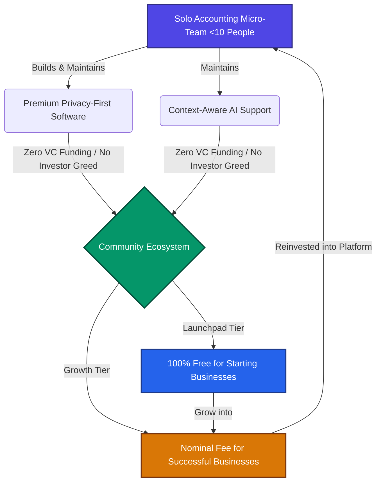

# 💡 Mission Statement - Solo Accounting

> [!IMPORTANT]
> **Our Core Mission:**
> **As a micro-business of fewer than 10 people, we are built by a small business to support the 36.2 million small businesses in the United States. We leverage high-leverage AI to deliver a premium, privacy-first accounting platform at near-zero cost—sustained entirely by the small business community, with zero venture capital influence.**

---

## 🎯 The Four Pillars of Our Mission

We believe that small businesses shouldn't be squeezed by expensive, bloat-driven software monopolies. By combining modern AI capabilities with a micro-team structure, we are executing a four-fold mission:

### 1. Small Business Solidarity (Micro-Team for Micro-Businesses)
We are not a massive corporation; we are a tight-knit team of fewer than 10 builders. We face the same challenges as the businesses we serve. By staying small and hyper-efficient, we prove that a dedicated micro-team can deliver enterprise-grade software without the need for large payrolls or corporate bloat.

### 2. A Community-Sustained Model (No Greedy VCs)
We are 100% self-sustained and have **zero venture capital funding**. We do not have greedy institutional investors to satisfy, which means we never have to artificially hike prices or harvest user data. Instead, we operate a community-supported ecosystem:
* **The Launchpad Tier (Free):** Starting and early-stage businesses get full access to the software for free, removing all barriers to launching a new business.
* **The Community Growth Tier (Nominal Monthly Fee):** Successful, established small businesses pay a nominal, flat monthly fee. This fee does not line the pockets of outside investors; instead, it directly funds continuous development and keeps the platform free for the next generation of starting businesses.

### 3. AI as a Reinvestment Force (Reclaiming the Narrative)
In a modern tech landscape where AI is often perceived as an extraction mechanism that displaces workers and takes wealth away from local communities, we want to pioneer a different path. We believe AI should be a high-leverage tool that *gives back* to the community. By using AI to automate the heavy administrative and operational overhead of running a software company, we can gift high-quality tools to starting entrepreneurs for free. We use AI to lift up small businesses, enabling them to remain competitive, create local jobs, and reinvest back into their own neighborhoods.

### 4. High-Leverage AI for Premium Support
Customer service and bookkeeping are historically the most expensive hurdles for small business owners. We deploy highly specialized, context-aware AI agents to provide:
* **Instant, 24/7 Technical Support:** Resolving software and setup questions immediately.
* **Intelligent Bookkeeping Services:** Eventually offering automated, high-accuracy bookkeeping at a fraction of standard bookkeeping rates.

---

## 📊 The Community-Supported Leverage Model

---

## 📈 Impact Blueprint

| Metric | Traditional Accounting SaaS | Solo Accounting Approach |
| :--- | :--- | :--- |
| **Funding Source** | Greedy VCs & Wall Street shareholders | Self-sustained & Community-supported |
| **Organizational Scale** | Thousands of employees (Bloated overhead) | Micro-team of < 10 high-leverage builders |
| **Core Target Market** | Globally diluted enterprises | US-focused small businesses & startups |
| **Support System** | Slow, outsourced support ticket queues | Instant, 24/7 AI-driven localized support |
| **Pricing Rationale** | Maximize shareholder value & annual price hikes | Support starting businesses through successful ones |

> [!TIP]
> By choosing Solo Accounting, successful businesses aren't just buying software—they are actively sponsoring early-stage entrepreneurs in their own community, creating a self-sustaining cycle of economic growth.