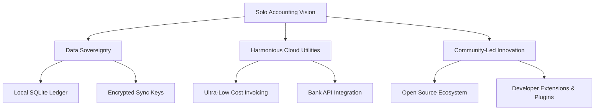

# 🚀 Long-Term Vision - Solo Accounting

## Core Vision
**To become the world's most trusted, open, and beautiful financial operating system for the self-employed, establishing a new paradigm where local-first privacy and cloud convenience coexist harmoniously.**

We envision a future where software respects human dignity and privacy. In this future, your financial ledger is as private and permanent as a physical notebook, yet as powerful, automated, and interconnected as any modern cloud-native system. 

Solo Accounting aspires to be the global default standard for independent business tracking, powering millions of micro-enterprises worldwide.

---

## 🏔️ Long-Term Aspirational Pillars

### 1. Data Sovereignty is a Human Right
We believe that a business's ledger represents its most sensitive intellectual property. Our vision is a world where no third-party vendor has default insight into your margins, vendors, or customers unless you explicitly permit it.

### 2. High-Utility Cloud Extensions at Cost
Cloud services (like real-time multi-device sync, bank feed feeds, and automated tax e-filing) should be charged as raw utility costs rather than high-margin premium markups. We aim to provide these services at near-cost (e.g., $2 to $5/month) to keep professional-grade tools accessible to all.

### 3. A Vibrant Open-Source Ecosystem
We envision a developer ecosystem where custom invoice templates, regional tax calculators, and industry-specific dashboards can be built as modules or extensions, giving Solo Accounting the flexibility of a massive ERP while maintaining a featherlight core.

---

> [!TIP]
> *By aligning our long-term goals with open-source communities and local-first architectures, we protect the project from corporate buyouts and product decay.*
