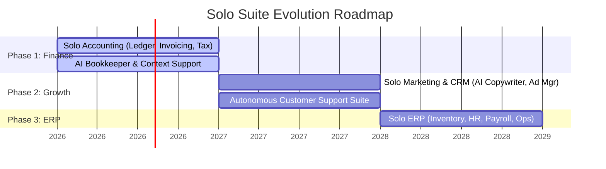
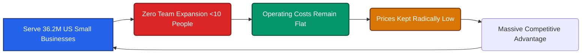

# 🚀 Long-Term Vision - Solo Accounting

> [!IMPORTANT]
> **Our Core Vision:**
> **To demonstrate that a hyper-focused micro-team of fewer than 10 people, augmented by advanced AI, can power and scale a comprehensive suite of business applications serving the 36.2 million small businesses in the United States—redefining product quality, operational cost, and customer empowerment without corporate or investor bloat.**

---

## 🗺️ The Horizon Roadmap: Beyond Accounting

Accounting is our beachhead. It is the core operating system of any business. Once we establish a rock-solid, local-first financial ledger built specifically for the nuances of US tax codes and compliance, we will expand our AI-native engine to capture other massive software categories for US small businesses. We purposefully remain US-focused: accounting software is highly regional and regulatory, and a localized approach ensures unmatched precision and compliance.

### 🎯 Phase 1: Solo Accounting (The Foundation)
Establish a local-first, privacy-respecting accounting engine tailored for US businesses. We will automate bank sync, invoicing, tax planning, and reporting, backed by autonomous AI agents that act as on-demand technical and bookkeeping staff.

### 📣 Phase 2: Solo Growth (The Marketing & Service Engine)
Extend our AI capabilities into customer acquisition and customer support for US small businesses:
* **AI-Native CRM & Marketing:** Autonomous tools that generate landing pages, write personalized outreach, optimize ad budgets, and track campaign performance.
* **Autonomous Support Portal:** Allowing small businesses to offer their own customers 24/7 AI-driven support that feels human, fast, and accurate.

### ⚙️ Phase 3: Solo ERP & Operations (The Complete Suite)
Deliver the ultimate, lightweight Enterprise Resource Planning (ERP) platform. From inventory tracking and supplier coordination to payroll and HR management, we will provide a unified dashboard where every operation is monitored and optimized by localized AI agents.

---

## ⚡ The "Zero-Bloat" Scaling Flywheel

Traditional software companies believe that more customers require more employees, which leads to organizational complexity, corporate bloat, and eventually, higher subscription prices for the end-user. 

We are pioneering the **Zero-Bloat Scaling Principle**:

By keeping our core engineering and operations team under 10 people:
1. **Unbeatable Value:** We do not have greedy VCs or Wall Street shareholders to feed. We can charge nominal, sustainability-oriented fees that cover our lean operations while directly supporting the broader small business community.
2. **Speed & Focus:** Decision-making remains instant. No corporate bureaucracy, no committee-driven designs—just pure, relentless product innovation.
3. **Data Sovereignty:** Because we do not need to monetize user data to feed a massive payroll, we can stand firm on our local-first, privacy-respecting principles.

---

## 📊 Market Opportunity & Impact

There are currently **36.2 million small businesses in the United States**, representing **99.9%** of all businesses. These businesses employ over 62 million people and generate nearly half of the country's GDP. 

Yet, they are squeezed by expensive software monopolies that hike prices annually. Solo Accounting will be the catalyst that frees them:

> [!TIP]
> Our ultimate success is not measured by our headcount, but by our **community multiplier**: proving that AI does not have to extract wealth or displace people from local communities. Instead, a single-digit team of elite builders can use AI to build and sustain world-class tools that lift up millions of independent business owners, keeping wealth and jobs exactly where they belong—in the local economy.