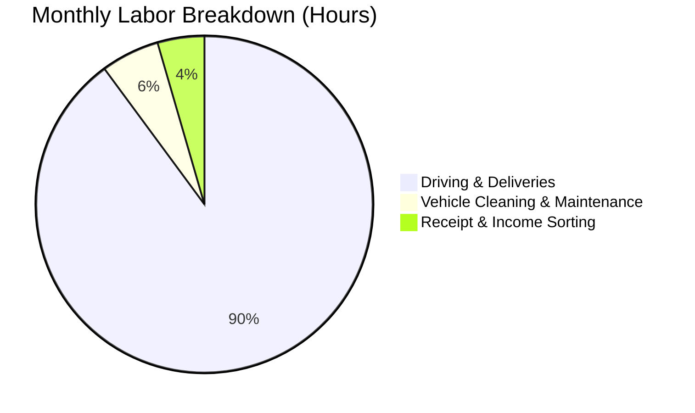

# 👥 User Persona: Diana Gigworker (The Multi-App Courier)

Diana drives for rideshare and food delivery apps full-time. She needs to manage vehicle expenses, track mileage, and understand her true take-home pay across multiple digital platforms.

---

## 👤 Profile & Demographics

* **Name:** Diana Gigworker
* **Age:** 31
* **Business Type:** On-Demand Transportation & Delivery Courier
* **Status:** Sole Operator / Independent Contractor
* **Annual Revenue:** ~$32,000 gross (payouts from apps)
* **Net Income:** ~$18,500 after accounting for high fuel costs, vehicle depreciation, insurance, and taxes

---

## 📅 Accounting Process

### Monthly
* **Income Aggregation:** Diana downloads weekly earnings summaries from rideshare and delivery platforms, manually adding them to a notes app or paper ledger to track total income.
* **Expense Tracking:** Fuel receipts are saved in the center console. She pays a high monthly premium for commercial rideshare insurance.
* **Mileage Logging:** She uses a basic odometer log book in her car to write down starting and ending mileage each day.

### Quarterly
* **Tax Payments:** She rarely makes quarterly payments, usually filing once at the end of the year and dealing with lump-sum tax bills.

---

## 💻 Software & Pain Points

### Current Setup
* **Tools:** Notes app, paper mileage ledger, glove box for paper gas receipts.
* **Banking:** Single personal checking account where all platform payouts are deposited directly.

### Core Pain Points
> [!IMPORTANT]
> **Depreciation Blind Spot:** Diana struggles to track vehicle depreciation and maintenance reserves, leading her to overestimate her hourly profit.
> 
> **Co-Mingled Funds:** Personal spending and business driving expenses are mixed in the same bank account, making tax write-offs extremely tedious to isolate.
> 
> **Tax Time Sticker Shock:** Because she does not calculate self-employment tax throughout the year, she faces a major financial crunch and payment penalties when filing in April.

---

## ⏱️ Labor & Financial Cost

### Labor Time
* **Odometer & Mileage Logging:** ~4 hours per month.
* **Receipt Collection & Income Auditing:** ~4 hours per month.
* **Tax Preparation Stress:** ~10 hours of manual lookup during tax season.

### Financial Costs
* **Bookkeeper/CPA Cost:** None (cannot afford professional services).
* **Tax Filing Software:** ~$150 per year for self-employed online tax preparation packages.
* **IRS Interest & Underpayment Penalties:** ~$100–$200 per year due to not filing quarterly estimated taxes.
