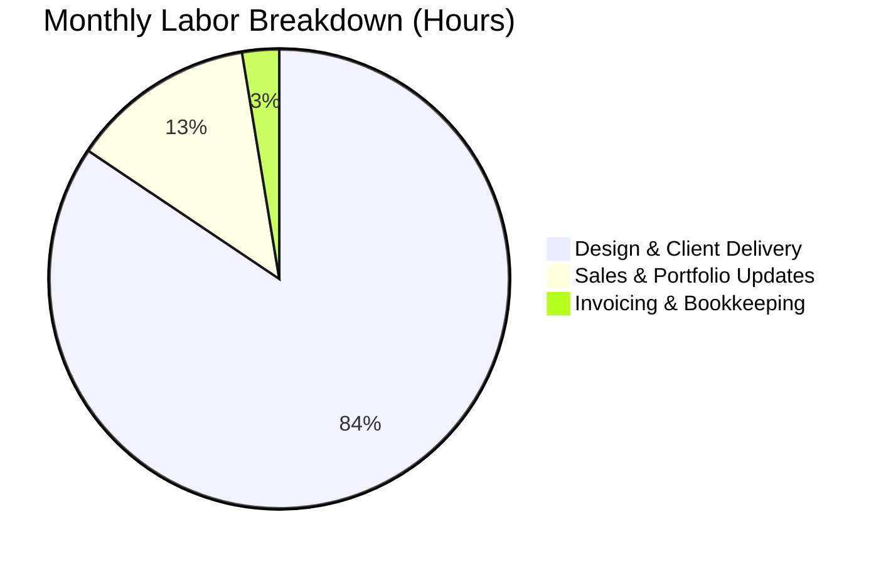

# 👥 User Persona: Elena Designer (The Digital Nomad Contractor)

Elena is a freelance UI/UX designer who works with start-ups and tech companies globally. She values simplicity, clean interfaces, and digital workflows that don't tie her to a physical desk.

---

## 👤 Profile & Demographics

* **Name:** Elena Designer
* **Age:** 28
* **Business Type:** Digital UI/UX & Brand Design Consultancy
* **Status:** Sole Operator (100% remote)
* **Annual Revenue:** ~$85,000 gross
* **Net Income:** ~$72,000 after software subscriptions, hardware upgrades, and home office deductions

---

## 📅 Accounting Process

### Monthly
* **Invoicing:** Elena sends professional PDF invoices to international and domestic clients at the end of each project milestone or month.
* **Subscription Tracking:** She tracks SaaS subscriptions (Adobe Creative Cloud, Figma, Webflow, Notion) via bank statements.
* **Deduction Logging:** She scans digital receipts and logs them directly to a Google Drive folder.

### Quarterly
* **Estimated Taxes:** Elena calculates her quarterly federal self-employment taxes and makes manual payments through the IRS EFTPS website.
* **Financial Review:** She runs a quick review of her income vs. expenses to adjust her project rates or monthly spending.

---

## 💻 Software & Pain Points

### Current Setup
* **Tools:** Notion templates for tracking active invoices, PDF invoice generator websites, Google Sheets for tracking tax-deductible expenses.
* **Banking:** Online-only digital business bank account.

### Core Pain Points
> [!TIP]
> **Multi-Currency Fees:** Elena receives payments in USD, EUR, and CAD. Bank transfer conversion rates and fees are hidden and hard to track, eroding her profit margin.
> 
> **Scattered Receipts:** Having digital receipts in email, Notion, and Google Drive makes it hard to aggregate deductions at tax time.
> 
> **Time-Tracking Integration:** Connecting billable design hours directly to invoices is a manual, disjointed step.

---

## ⏱️ Labor & Financial Cost

### Labor Time
* **Invoice Generation & Client Follow-Ups:** ~2 hours per month.
* **Expense Log & Receipt Backup:** ~2 hours per month.
* **Quarterly Tax Filings:** ~3 hours per quarter.

### Financial Costs
* **Invoicing / Time Tracking Tool Subscription:** ~$150 per year.
* **Foreign Exchange (FX) & Wire Fees:** ~$900 per year.
* **Annual CPA Consultation:** ~$600 per year.
