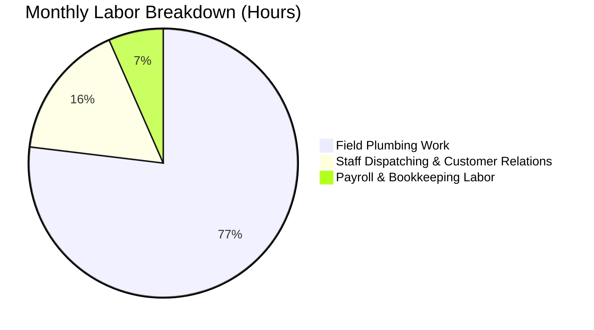

# 👥 User Persona: Joe Plumber (The Active Trade Operator)

Joe owns and operates a residential plumbing service. He is constantly on the move, managing customer calls, dispatching technicians, and handling immediate business cash flows.

---

## 👤 Profile & Demographics

* **Name:** Joe Plumber
* **Age:** 45
* **Business Type:** Residential Plumbing & Service Maintenance
* **Status:** Owner-operator with 3 full-time junior technicians/apprentices
* **Annual Revenue:** ~$240,000 gross
* **Net Income:** ~$85,000 after wages, vehicle maintenance, insurance, and inventory/parts

---

## 📅 Accounting Process

### Monthly
* **Field Invoicing:** Joe or his techs write paper invoices on-site or use a simple mobile payments app to collect payments on the spot.
* **Payroll Processing:** Joe processes employee paychecks bi-weekly, calculating hours worked and withholding taxes manually using IRS charts or a basic online payroll calculator.
* **Expense Tracking:** Fuel receipts, merchant invoices for copper pipes and fittings, and vehicle maintenance bills are compiled in a vehicle glove box and sorted monthly.

### Quarterly
* **Tax Filing:** Joe submits quarterly payroll tax withholdings and state sales taxes.
* **Accountant Visit:** Joe hands over a folder of physical invoices and receipts to a professional bookkeeper to balance the ledger.

---

## 💻 Software & Pain Points

### Current Setup
* **Tools:** Basic mobile card reader app, paper invoice booklets, Excel for payroll.
* **Banking:** Dedicated business checking account.

### Core Pain Points
> [!IMPORTANT]
> **Payroll Complexity:** Calculating employee withholdings, overtime, and state/federal unemployment taxes takes hours and is prone to arithmetic errors.
> 
> **Invoice Leakage:** Techs sometimes forget to log physical invoice booklets or parts used, resulting in unbilled materials and lost revenue.
> 
> **Cash Flow Visibility:** Because receipts and invoices aren't updated in real time, Joe is never sure how much cash he actually has free until his monthly bank statement reconciles.

---

## ⏱️ Labor & Financial Cost

### Labor Time
* **Invoicing & Receipt Sorting:** ~6 hours per month.
* **Payroll & Withholding Work:** ~6 hours per month.
* **Quarterly Tax Prepping:** ~5 hours per quarter.

### Financial Costs
* **Bookkeeper/Accounting Service:** ~$1,200 per year.
* **CPA Year-End Tax Prep:** ~$1,000 per year.
* **Payroll Calculator Subscription:** ~$240/year.
* **Lost Parts/Materials (Leakage):** Estimated at ~$1,500/year due to poor inventory tracking on field invoices.
