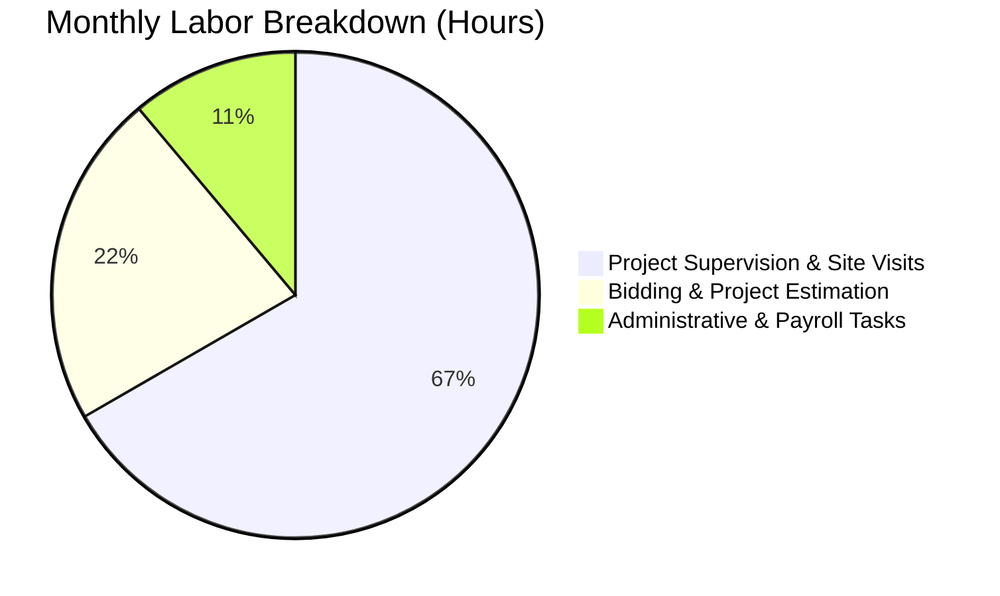

# 👥 User Persona: Marcus Contractor (The Expanding Builder)

Marcus is a licensed general contractor running a residential remodeling and repair company. With 8 employees and multiple active job sites, his business has outgrown simple spreadsheets, but enterprise accounting software feels overly complex and expensive.

---

## 👤 Profile & Demographics

* **Name:** Marcus Contractor
* **Age:** 51
* **Business Type:** General Construction & Remodeling Services
* **Status:** Small Business Owner with 8 full-time and part-time crew members
* **Annual Revenue:** ~$650,000 gross
* **Net Income:** ~$115,000 after wages, subcontractor fees, materials, equipment leases, and liability insurance

---

## 📅 Accounting Process

### Monthly
* **Subcontractor & Vendor Payments:** Marcus manages invoices from drywallers, electricians, and lumber yards, coordinating payments against project completion milestones.
* **Employee Payroll:** Processes bi-weekly payroll for 8 crew members with varying hours, union dues, and workers' comp categories.
* **Bank Reconciliation:** Reconciles high-volume debit transactions from lumber runs and hardware store trips.

### Quarterly
* **Corporate Tax Filing:** Marcus relies on a professional bookkeeper to prepare corporate income tax, workers' compensation audits, and state withholding returns.
* **Sales Tax:** Submits state sales tax on materials billed to projects.

---

## 💻 Software & Pain Points

### Current Setup
* **Tools:** High-tier subscription to a major commercial accounting software, Excel for custom project estimates, paper payroll sheets.
* **Banking:** Business checking, business savings, and 3 employee debit cards for field material runs.

### Core Pain Points
> [!CAUTION]
> **Steep Learning Curves & Bloat:** Marcus uses less than 20% of the features in his commercial accounting suite but is forced to pay for the high-end package just to support 8 employees.
> 
> **High Cost of Licensing:** Extra seats for his project manager and bookkeeper cost hundreds of dollars extra per month.
> 
> **Job Costing Friction:** Tracking materials and hours spent on a *specific* kitchen remodel vs. another project is highly manual and inaccurate, leading to poor profit estimation.

---

## ⏱️ Labor & Financial Cost

### Labor Time
* **Weekly Payroll & Time Sheets:** ~8 hours per month.
* **Vendor Invoice Processing & Job Costing:** ~12 hours per month.
* **Audit & Tax Prep Preparation:** ~6 hours per quarter.

### Financial Costs
* **Enterprise Software Subscriptions:** ~$1,800 per year (including payroll add-ons and extra seats).
* **Monthly Bookkeeping Service:** ~$2,400 per year ($200/month).
* **Year-End CPA Corporate Filings:** ~$3,500 per year.
