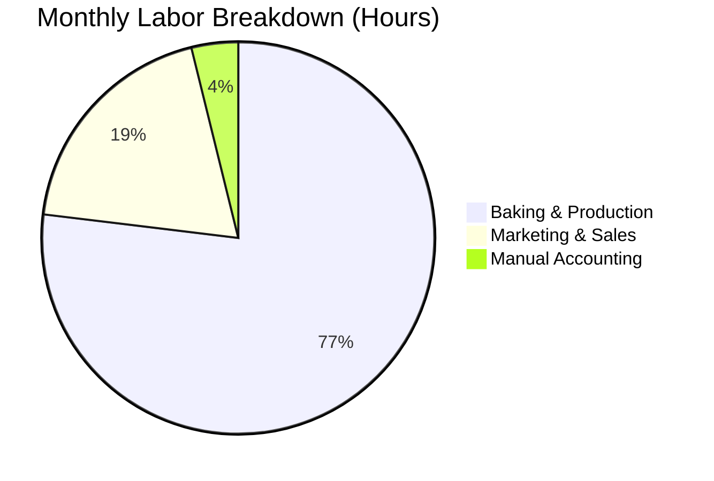

# 👥 User Persona: Sarah Baker (The Passionate Solopreneur)

Sarah runs a small, artisanal home bakery. She is passionate about baking but finds accounting and business administration to be stressful and overwhelming.

---

## 👤 Profile & Demographics

* **Name:** Sarah Baker
* **Age:** 34
* **Business Type:** Artisanal Home Bakery (custom cakes, local farmer's markets, direct-to-consumer)
* **Status:** Sole Operator (planning to hire her first part-time kitchen assistant next season)
* **Annual Revenue:** ~$45,000 gross
* **Net Income:** ~$28,500 after cost of ingredients, packaging, and home kitchen utility overhead

---

## 📅 Accounting Process

### Monthly
* **Receipt Capture:** Sarah collects physical paper receipts for flour, butter, packaging, and utensils in a shoe box. At the end of the month, she manually snaps photos of them or stacks them in order.
* **Spreadsheet Entry:** She spends one Sunday afternoon typing transaction data from receipts and bank statements into a basic Microsoft Excel spreadsheet.
* **Invoicing:** She tracks custom cake orders and deposits using Google Docs templates, manually marking them as "PAID" when a bank transfer or cash payment is received.

### Quarterly
* **Estimated Taxes:** Sarah manually calculates her quarterly self-employment and state sales tax obligations using simple percentages.
* **CPA Check-In:** She spends about 2 hours preparing her Excel sheets and sends them to a local CPA to double-check her figures and help her file estimated taxes.

---

## 💻 Software & Pain Points

### Current Setup
* **Tools:** Microsoft Excel (manual spreadsheet), Google Docs (invoices), physical folder for paper receipts.
* **Banking:** Single personal bank account with a separate sub-account for business transactions, making clean separation difficult.

### Core Pain Points
> [!WARNING]
> **Recipe-to-Cost Mapping:** Excel does not easily help her map changing flour and butter prices to custom cake margins, leading to underpricing.
> 
> **Receipt Loss & Fade:** Thermal paper receipts frequently get lost or fade before she logs them.
> 
> **Self-Employment Tax Anxiety:** She lives in constant fear of underpaying quarterly taxes and receiving a surprise tax bill at the end of the fiscal year.

---

## ⏱️ Labor & Financial Cost

### Labor Time
* **Invoicing & Receipt Logging:** ~4 hours per month.
* **Monthly Bookkeeping & Reconciliation:** ~2 hours per month.
* **Quarterly Review Preparation:** ~4 hours per quarter.

### Financial Costs
* **Spreadsheet Software:** Free/bundled.
* **CPA Estimated Tax Reviews:** ~$350 per quarter ($1,400/year).
* **Late Payment Penalties:** Occasional minor IRS/State penalties (~$100/year) due to missed estimated tax filing dates.
