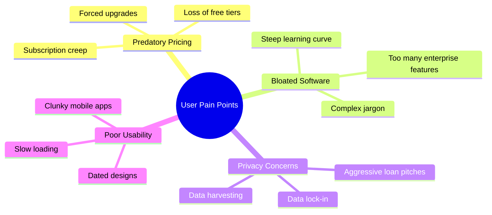

# 👥 User Research Summary - Solo Accounting

This document summarizes our target audience research, user archetypes, pain points with existing financial platforms, and core user workflows that must shape the product requirements.

---

## 🎯 Target Audience

Our primary users are **independent operators** who manage their own books. They are not professional accountants, and they often find bookkeeping to be the most stressful aspect of running their business.

* **Freelancers & Solopreneurs:** Creative designers, copywriters, software contractors, and consultants.
* **Gig Economy Workers:** Rideshare drivers, delivery partners, and independent tutors.
* **Micro-Businesses (1-3 Employees):** Small boutique shops, local service providers, and family-owned businesses.

---

## 💔 Existing Pain Points & Market Frustrations

1. **Predatory Subscription Creep:** Industry leaders like QuickBooks and Xero continuously increase their monthly subscription rates, forcing micro-businesses to pay $30-$60/month for basic features they rarely use.
2. **Elimination of Free Tiers:** Competitors like Wave have repeatedly limited or monetized their previously free plans, leaving users with few cost-effective, high-quality options.
3. **Invasive Up-selling & Ad-scraping:** Many "free" platforms harvest transaction data to pitch loans, lines of credit, or credit cards, creating a noisy and untrustworthy user experience.
4. **Steep Learning Curves & Accounting Jargon:** Most tools force users to think like certified accountants, using intimidating terms (ledger entries, journal adjustments, depreciation tables) instead of simple business language.

---

## 👤 User Archetypes

### 1. Sarah - The Creative Freelancer (Designer)
* **Goal:** Create and send stunning invoices in seconds, track client payments, and get a quick snapshot of her monthly income.
* **Frustrations:** "I don't need inventory management or payroll. I just want my invoices to look beautiful and get paid quickly without paying $350 a year for the privilege."
* **Core Need:** Beautiful templates, client list, simple invoice engine, credit card processing integration.

### 2. Alex - The Technical Contractor (Developer)
* **Goal:** Log hours, track multi-currency project expenses, and calculate quarterly estimated tax obligations.
* **Frustrations:** "I hate cloud vendors having my absolute detailed earnings, and I don't want to get locked in if they double their rates next year."
* **Core Need:** Absolute data sovereignty (local file), quick CSV bank statement import, time-tracking, tax categorizations.

---

## 🛠️ User Bookkeeping Workflow

1. **Transaction Entry:** Importing transaction lines via CSV upload or typing them manually.
2. **Categorization:** Instantly mapping transactions to simplified categories (e.g., "Software subscription", "Travel", "Client Payment").
3. **Invoicing:** Drafting an invoice, exporting it to a PDF or sending a payment link, and tracking payment status.
4. **Tax Time:** Generating a simplified Profit & Loss (P&L) report and exporting transaction logs to share with an accountant (CSV/Excel).

---

> [!TIP]
> **Product Design Directive:** The software should speak in plain language. Instead of asking for a *credit* or *debit*, the UI should ask: *"Did you spend money or receive money?"*
