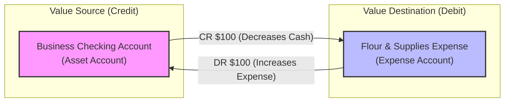

# 🧱 Core Double-Entry Ledger Architecture

In **Solo Accounting**, we believe that even the simplest micro-business deserves absolute financial clarity. At the heart of our software is a **Double-Entry Ledger Engine**. Although it operates completely behind the scenes, understanding this engine is key to knowing why Solo Accounting is exceptionally reliable.

---

## 💡 What is Double-Entry Bookkeeping? (In Plain English)

Imagine you spend $100 on flour for your bakery. In a simple single-entry spreadsheet, you just write down: `Spent $100 on flour`. But that only tells half the story. Where did the $100 come from? Did it come from your business checking account? Your personal pocket? A credit card?

**Double-entry bookkeeping solves this by ensuring every financial event has a source and a destination.** 
Money never appears or disappears out of thin air; it is always **moved** from one account to another. Every transaction is a story with two sides:
1. **Where did the value come from?** (The Source)
2. **Where did the value go?** (The Destination)

> [!NOTE]
> Under double-entry rules, the sum of all your business assets must always equal the sum of what you owe (Liabilities) plus what you actually own outright (Equity).
> $$\text{Assets} = \text{Liabilities} + \text{Equity}$$

---

## 🔄 The Balancing Act: Debits and Credits

In traditional accounting, these two sides are called **Debits** and **Credits**. Don't let these terms scare you! 
* **Debit (DR):** An entry on the left side of the ledger. It represents where value is **received** or **accumulated** (like cash entering your bank account, or an expense being paid).
* **Credit (CR):** An entry on the right side of the ledger. It represents where value **originates** or is **given up** (like money leaving your bank account, or revenue earned).

Because every transaction must balance, the total amount of Debits must **always** equal the total amount of Credits.

### 📊 How Accounts React to Debits & Credits

| Account Type | What it represents | Impact of a Debit (DR) | Impact of a Credit (CR) |
| :--- | :--- | :--- | :--- |
| **Assets** | What the business owns (Cash, Inventory, Equipment) | ➕ Increases | ➖ Decreases |
| **Liabilities** | What the business owes to others (Loans, Credit Cards) | ➖ Decreases | ➕ Increases |
| **Equity** | The owner's share of the business | ➖ Decreases | ➕ Increases |
| **Revenue** | Money earned from sales | ➖ Decreases | ➕ Increases |
| **Expenses** | Costs incurred to run the business (Rent, Supplies) | ➕ Increases | ➖ Decreases |

---

## 🛠️ Visualizing a Transaction Flow

Let's see what happens behind the scenes when **Sarah (the baker)** buys $100 of organic flour using her business debit card:

Because the cash decreases by $100 (Credit) and expenses increase by $100 (Debit), the transaction is **perfectly balanced**.

---

## 🛡️ Why This Guarantees Absolute Financial Truth

By building Solo Accounting on a formal double-entry ledger, we eliminate the most common bugs found in amateur spreadsheets:

1. **No Orphan Transactions:** You cannot log an expense without specifying how it was paid. This prevents mysterious gaps at tax time.
2. **Built-in Error Detection:** If the system attempts to save a transaction where debits do not equal credits, it will throw a validation error. The ledger is mathematically incapable of being out of balance.
3. **Accurate Financial Reports:** A proper Profit & Loss Statement and Balance Sheet can only be generated from a double-entry system. This gives your CPA instant confidence and saves you thousands in tax prep fees.

> [!TIP]
> **AI-Friendly Advantage:** Because our database strictly enforces these double-entry rules, our AI agent can safely log transactions or categorize bank imports without any risk of corrupting your financial books.
