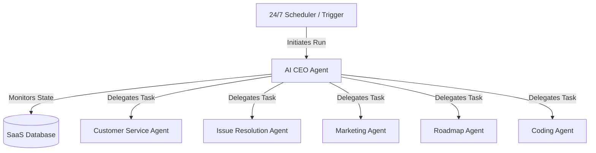
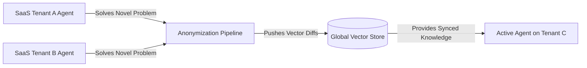

# 🤖 Polsia-Inspired Multi-Agent & Orchestration Framework

This document specifies the multi-agent orchestration architecture for **Solo Accounting**. It details a system modeled directly after **Polsia**, designed to run business operations continuously in the cloud while the founder sleeps, leveraging a central AI CEO orchestrator and a shared Cross-Company Learning System.

---

## 👑 The AI CEO Orchestration Framework

Rather than running independent, uncoordinated agents, Solo Accounting uses a centralized **Hub-and-Spoke Orchestration Model** governed by an **AI CEO Agent**.

### The AI CEO's Operational Cycle:
1. **State Evaluation:** Every night (or triggered by webhooks), the AI CEO reads the global state of the tenant's workspace (e.g., unreconciled transactions, unpaid invoices, open support tickets, bug alerts).
2. **Prioritization & Planning:** The CEO plans the necessary business actions, sets high-level objectives, and creates a task list in the central database.
3. **Delegation:** The CEO spawns specialized worker agents, passing them highly scoped prompts and sandboxed database sessions.
4. **Validation & Reporting:** The CEO monitors the execution status, gathers agent outputs, compiles a morning briefing report, and queues any high-risk tasks for human verification (HITL).

---

## 🌐 Global Cross-Company Learning System

To accelerate performance and slash API token costs across the entire SaaS platform, Solo Accounting features a **Cross-Company Learning Engine**:

1. **Insight Capture:** When a Coding Agent successfully patches a bug, or the Bank Sync Agent resolves a complex merchant classification, the solution is captured.
2. **Anonymization Pipeline:** An isolated worker strips away all tenant-specific data (e.g., company names, user UUIDs, specific transaction amounts).
3. **Global Vector Upload:** The anonymized insight is transformed into a vector and stored in a shared global database.
4. **Shared Retrieval:** When an active agent on *any* workspace faces a task, it performs a hybrid vector search against the Global Learning Store to retrieve proven solutions, bypassing expensive LLM reasoning and slashing token bills.

---

## 🔒 Isolated Serverless Sandbox Runtimes

To allow agents to safely write, run, and test code on a multi-tenant SaaS without cross-tenant compromise:

* **Firecracker MicroVMs:** Each Coding Agent task is executed inside an ephemeral, highly isolated **AWS Firecracker microVM**.
  * **Startup Latency:** < 5 milliseconds.
  * **Network Rules:** Completely offline by default. Only safe loopback APIs allowed to fetch scoped repositories and push Git diffs back to the secure code repository.
  * **Ephemeral Storage:** The sandbox is fully destroyed upon command completion. No persistent states are kept inside the execution runtime.
