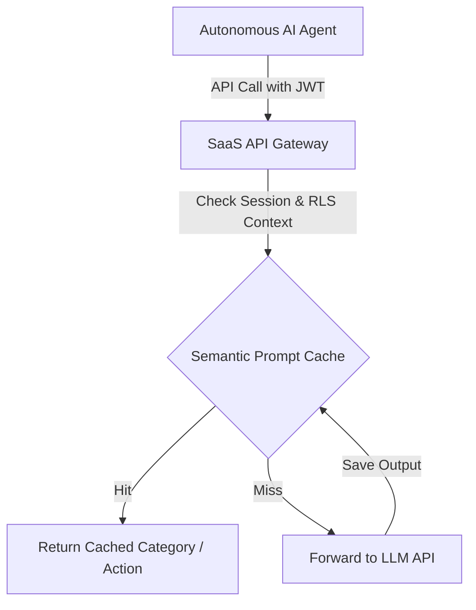

# 🤖 SaaS-Optimized AI Interface & Gateway

This document defines how AI agents securely interface with the centralized Cloud SaaS backend. It details token-optimization protocols, payload structures, and semantic caching layers designed to keep agent API operational costs minimal.

---

## 🛰️ Cloud API Gateway & Structured Prompting

In our SaaS architecture, agents interact with the backend via the primary API Gateway, governed by JWT authentication and tenant-level access scopes. 



To prevent LLMs from wasting tokens parsing massive raw tables, the API Gateway provides compact, pre-structured context endpoints tailored specifically for LLMs.

### 1. `GET /api/v1/context/ledger-compact`
Returns a token-dense JSON payload containing only active, actionable ledger structures:
```json
{
  "tenant_uuid": "e4a2-11ee-83af",
  "currency": "USD",
  "coa_hash": "a4f89d",
  "active_accounts": [
    { "code": "1010", "name": "Cash on Hand", "type": "asset" },
    { "code": "5030", "name": "Software & Tools", "type": "expense" }
  ],
  "pending_reconciliation_count": 14
}
```

---

## ⚡ Centralized Semantic Prompt Caching (Redis)

Because classifying transactions (e.g., matching bank descriptions like `GITHUB SPONSORS` or `UBER TRIP`) is repetitive across millions of users, Solo Accounting implements a **Centralized Semantic Prompt Cache** using Redis:

1. **Embedding Generation:** When a transaction categorization query is initiated, the description is converted into a vector embedding using a fast, low-cost local pipeline.
2. **Cosine Similarity Lookup:** The gateway checks the Redis vector cache:
   $$\text{Similarity} = \frac{A \cdot B}{\|A\| \|B\|}$$
3. **Cache Hit:** If a match exceeds 95% similarity, the gateway returns the cached category instantly, **bypassing the LLM API completely**.
4. **Cache Miss:** Only true anomalies or novel merchants are sent to the frontier LLM API, and their outputs are immediately cached globally (anonymized) to benefit all tenants.

---

## 🛡️ Mutation Guardrails & JWT Scoping

Agents are forbidden from writing direct raw database mutations. They operate purely under restricted **SaaS JWT Scopes**:

* **Scope: `agent:read`** - Allows querying anonymized context summaries, checking ledger balances, and generating reports.
* **Scope: `agent:propose`** - Allows creating transaction draft entries and submitting them to the Human-in-the-loop (HITL) approval queues. Agents *cannot* directly authorize transactions or alter closed ledger states.
* **Validation Engine:** Before committing any proposed draft, the gateway validates that the double-entry constraints balance exactly, preventing agent hallucinations from introducing math errors.
