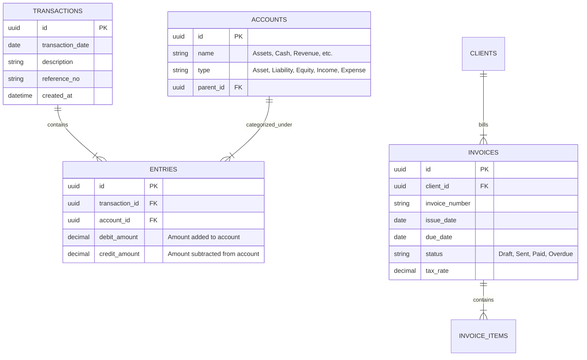

# 🏗️ Technical Architecture Summary - Solo Accounting

This document details the engineering guidelines, proposed technical stack, database schema design, and security architecture designed to enforce Solo Accounting's core "local-first" philosophy.

---

## 💻 Recommended Tech Stack

To maximize performance, reliability, and visual flexibility, we propose a modern desktop-first and local-web architecture:

```text
┌─────────────────────────────────────────────────────────────────┐
│                     USER INTERFACE (HTML5/CSS/JS)               │
│         Next.js / Vite + SolidJS (Premium Rich Styling)         │
└────────────────────────────────┬────────────────────────────────┘
                                 │ Inter-process Communication (IPC)
┌────────────────────────────────▼────────────────────────────────┐
│                   DESKTOP APPLICATION CONTAINER                 │
│         Tauri (Rust-based shell, ultra-lightweight, 10MB RAM)   │
└────────────────────────────────┬────────────────────────────────┘
                                 │ Native Rust Bindings
┌────────────────────────────────▼────────────────────────────────┐
│                      LOCAL DATA STORAGE                         │
│         SQLite Database File (Instant Local SQL Queries)        │
└─────────────────────────────────────────────────────────────────┘
```

1. **Frontend Core:** **Vite + React or SolidJS**. Vanilla CSS styling for fluid animations, custom HSL styling, and dark-mode performance.
2. **Desktop Shell:** **Tauri**. We reject Electron due to its massive memory consumption and bloated package sizes. Tauri uses the system's native webview and compiles directly to Rust, resulting in tiny executables (< 10MB) and near-zero idling RAM.
3. **Local Database:** **SQLite**. SQLite is the gold standard for robust local files. The entire business ledger is a single file (e.g., `my_business.db`), allowing effortless backup and portability.

---

## 🗄️ Conceptual Database Schema

Our relational SQL schema is normalized to ensure perfect mathematical consistency for double-entry bookkeeping:



---

## 🔒 Security & E2EE Sync Mechanics

To enable multi-device sync without compromising privacy, Solo Accounting implements a **Zero-Knowledge Architecture**:

1. **Local Keychain Encryption:** The local SQLite database is encrypted on-disk using **SQLCipher** (AES-256), with the decryption key stored securely in the operating system's native keychain (Windows Credential Manager / macOS Keychain).
2. **End-to-End Encrypted (E2EE) Sync:**
   * When sync is enabled, a standard sync key is generated locally (not shared with the server).
   * All synchronization data is compressed, encrypted locally via **AES-GCM-256**, and sent to the cloud sync host.
   * The hosting server only sees arbitrary, opaque bytes of ciphertext. It is mathematically impossible for server operators or hackers to view transactions, clients, or revenue figures.

---

> [!CAUTION]
> **Data Integrity Constraint:** In double-entry bookkeeping, the total debits must always equal total credits for any transaction:
> $$\sum \text{Debits} = \sum \text{Credits}$$
> The database layer must use transactional SQL rollbacks and rigid constraint checks to ensure no unbalanced ledger entries can ever be committed to disk.
