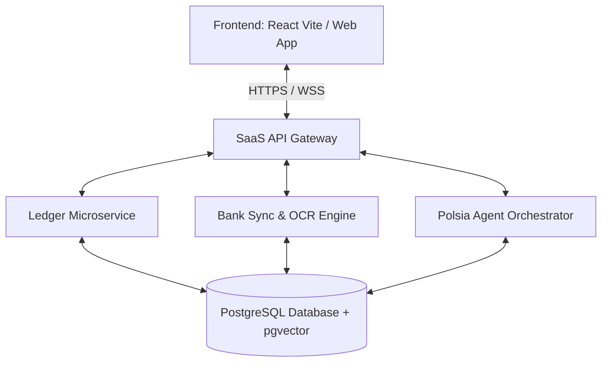

# 🏛️ Centralized Cloud-Native & Multi-Tenant Core Platform

This document details the architectural blueprint of the centralized, multi-tenant cloud-native backend for **Solo Accounting**. It outlines a high-scale, secure SaaS architecture designed to support millions of user ledgers, robust automated bank integrations, and background AI execution without cross-tenant leakage.

---

## ☁️ Cloud-Native Multi-Tenant Architecture

To eliminate user-side setup friction and support continuous background agent execution, Solo Accounting operates on a fully managed SaaS infrastructure:

* **Instant Access:** Users log in via standard web browsers or mobile apps, requiring no local databases, docker nodes, or file management.
* **Serverless Scale:** Compute services are hosted on elastic container runtimes (e.g., AWS ECS Fargate or Google Cloud Run), matching compute costs directly to active demand.
* **Aggregated Bank Syncing:** Centralized banking integrations securely pull real-time bank feeds and push them to categorization queues.



---

## 💾 Multi-Tenant Database Layer (PostgreSQL & Row-Level Security)

Rather than distributing isolated SQLite files, all data is consolidated inside a high-performance **PostgreSQL** database cluster. Data separation is enforced cryptographically and logically at the database level:

### 1. Row-Level Security (RLS)
Every table contains a `tenant_id` UUID column. PostgreSQL Row-Level Security policies are strictly applied to ensure that no session can read or write data belonging to another tenant:

```sql
-- Enable Row-Level Security on critical financial tables
ALTER TABLE ledger_entries ENABLE ROW LEVEL SECURITY;

-- Create policy forcing tenant isolation based on application context
CREATE POLICY tenant_isolation_policy ON ledger_entries
    USING (tenant_id = NULLIF(current_setting('app.current_tenant_id', true), '')::uuid);
```

### 2. Semantic Search Layer (`pgvector`)
The database cluster integrates the **`pgvector`** extension to store and search vector embeddings natively.
* **Transaction Embeddings:** Transaction descriptions are converted into 384-dimensional embeddings (using localized sentence-transformers) and indexed using HNSW (Hierarchical Navigable Small World) for sub-millisecond similarity matches.
* **Chart of Accounts Mapping:** Enables extremely rapid transaction categorization against the Chart of Accounts using vector distance matching.

---

## 🧩 Microservice Boundaries

Services are containerized and deployed into a secure virtual private cloud (VPC), decoupled to isolate errors:

### 1. Ledger Service
The central, immutable engine enforcing standard double-entry accounting constraints.
* **Stack:** Go / Rust.
* **Constraints:** Enforces total balancing ($\sum \text{Debits} = \sum \text{Credits}$) at the database transaction layer.
* **Partitioning:** Database partitions separate active fiscal years to keep search indexes extremely small and fast.

### 2. Bank Aggregator Service
Manages webhook listeners and triggers ingestion pipelines.
* **Integration:** Direct integration with Plaid, Teller, and regional Open Banking APIs (PSD2).
* **Ingestion:** Securely queues raw JSON feeds into an asynchronous processing broker (e.g., RabbitMQ or AWS SQS) for processing by the classification engine.

### 3. PDF & QR Billing Engine
Responsible for generating client invoices, calculating dynamic sales taxes, and appending digital payment QR codes.
* **Stack:** Node.js serverless workers.
* **Payment Standards:** Native rendering of Swiss QR-bills, UPI Payment Codes, and Pix dynamic payment strings.

---

## ⚡ Cloud Communications Protocol

Microservices inside the VPC communicate using highly efficient protocols to minimize internal latency:

| Connection | Protocol | Rationale |
| :--- | :--- | :--- |
| **Client to Gateway** | HTTPS / WSS (WebSockets) | Real-time dashboards, live agent logs stream. |
| **Internal Microservices** | gRPC (Protocol Buffers) | Ultra-low latency, strict binary serialization, compile-time type checks. |
| **Event Pipeline** | AMQP (RabbitMQ / AWS SQS) | Decouples bank ingestion and OCR document processing from the core user interface thread. |
