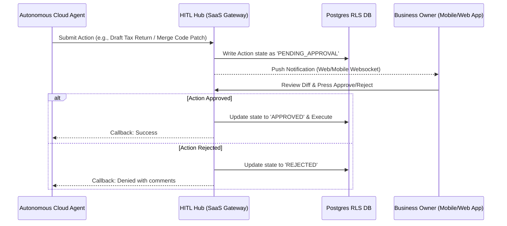

# 🖥️ SaaS Telemetry & Agent Workspace (Internal Dashboard)

This document specifies the architecture of the **Centralized Telemetry & Agent Workspace** for Solo Accounting. It defines the cloud dashboard used by SaaS administrators and business owners to monitor agent performance, audit operations, and manage the Human-in-the-Loop validation pipeline.

---

## 📈 SaaS Cost Telemetry Dashboard

Because autonomous agents consume frontier LLM API credits, administrators need real-time, granular visibility into token costs and operational overhead.

```text
+--------------------------------------------------------------------------------+
| SaaS SYSTEM TELEMETRY                                          [Status: HEALTHY]|
+--------------------------------------------------------------------------------+
| Active Tenants: 14,250 | Active Agents Run: 3,412 | System CPU: 24%            |
| Daily API Cost: $142.50 | Redis Cache Hit Rate: 84.2%  | Token Economy: +18.4%      |
+--------------------------------------------------------------------------------+
| Tenant:Sarah's Bakery  | Agent:CodingAgent | State:Testing | Daily Cost:$0.45  |
| Tenant:Joe Plumber     | Agent:CEOAgent    | State:Idle    | Daily Cost:$0.12  |
+--------------------------------------------------------------------------------+
```

### Key Cost Metrics Tracked:
* **Token Ingestion Pipeline:** Prompts, completions, and cached-input tokens processed per tenant.
* **Compute Cost Matrix:** Serverless runtime execution duration for running background tasks.
* **Cache Savings Ratio:** Tracks financial savings generated by the Redis semantic cache.

---

## 📱 Human-in-the-Loop (HITL) Central Gatekeeper

Autonomy handles execution, but business owners retain complete authority over significant events. The dashboard exposes a secure, web-native **HITL Review Board**:



### Guarded Operations (Strictly requiring HITL):
1. **Financial Releases:** Any draft payouts, invoice releases over $500, or raw tax file submissions.
2. **Code Merges:** Before the automated Coding Agent can merge a patch into the tenant's running code pipeline.
3. **Public Marketing:** AI-generated email campaigns or social outreach posts.

---

## 📜 Multi-Tenant Tamper-Evident Audit Logs

To comply with accounting regulations and guarantee user safety, all agent actions are logged into a secure PostgreSQL partition:

* **Structure:** Each log entry is stamped with `tenant_id`, `agent_uuid`, client IP, cryptographic checksum of input payload, and final operation state.
* **Audit Trails:** Logs are partitioned by month and marked as immutable using database-level write-once rules.
* **Transparency:** Users can view the complete conversational trajectory and file-diff history of the agent for every single task executed on their workspace.
