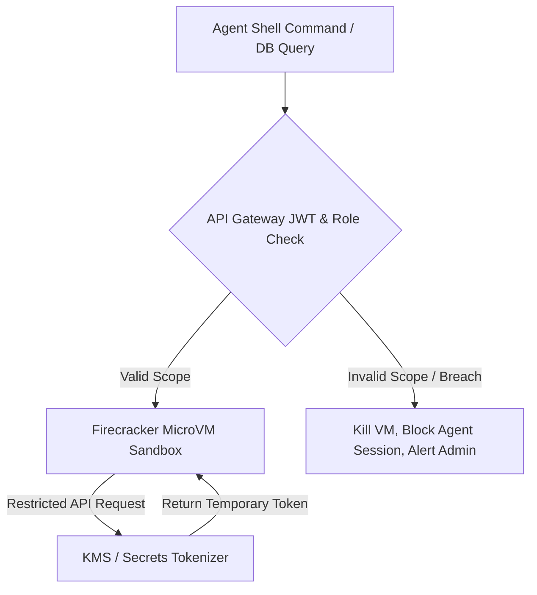

# 🔒 Cloud-Native Sandbox & SaaS Security Safeguards

This document specifies the core security architecture for **Solo Accounting** operating as a centralized SaaS. Because the platform executes autonomous coding and business agents on behalf of users, maintaining strict, ironclad isolation barriers between tenant environments is of paramount importance.

---

## 🚫 SaaS Multi-Tenant Security Pillars

1. **Zero-Trust Multi-Tenancy:** A database breach or a compromise in one tenant's agent sandbox must never leak credentials, data, or source code to another tenant.
2. **Ephemeral Computation:** Runtimes are short-lived. Sandboxes spin up, perform a single task (e.g., parsing a bank feed or running a test suite), and are instantly destroyed.
3. **No Direct Secret Access:** Agents never read raw system environment variables containing API keys (like Plaid, Stripe, or OpenAI keys).

---

## 🏗️ MicroVM Isolation & Execution Guardrails

Any task requiring script execution, testing, or code compilation (the **Coding Agent's** domain) is sandboxed inside an isolated **AWS Firecracker microVM**:

* **Filesystem Isolation:** The sandbox contains a minimal Linux OS. The repository is checked out into a read-only bind-mount. The agent is only allowed write access to a small, temporary `/workspace/scratch` directory.
* **Network Blackout:** The microVM has **no direct outbound internet access**. It communicates with our internal platform services strictly through a local Unix domain socket connected to a loopback API Proxy.
* **Hardware Quotas:**
  * CPU: Restricted to 0.5 vCPU.
  * Memory: Capped at 256 MB.
  * Time limit: Hard-timeout after 60 seconds of continuous execution.

---

## 🔑 Centralized Secrets Vaulting (AWS KMS / HashiCorp Vault)

To protect highly sensitive customer accounts (bank feeds, Stripe payouts, email servers):

* **The Token Exchange Endpoint:** When an agent needs to trigger an action (e.g., the Marketing Agent sending an email through SendGrid), it never queries `process.env.SENDGRID_API_KEY`.
* **Scoped Action Relays:**
  1. The agent calls a localized, internal service endpoint: `POST /api/v1/relays/email`.
  2. The gateway validates the agent's active session, tenant ID, and permissions.
  3. The gateway fetches the SendGrid API key from **AWS KMS / HashiCorp Vault**, wraps the payload, and makes the API call on behalf of the agent.
  4. The agent only receives a success/fail response and a tracking ID, completely preventing token extraction attacks.

---

## 🛡️ Input Sanitization & SQL Guardrails

* **Shell-Injection Mitigation:** All command requests sent to the microVM parser are strictly sanitized. All shell chaining characters (`&&`, `;`, `||`, `|`, `` ` ``, `$()`) are blocked, and arguments are passed exclusively as static arrays.
* **SQL Injection Mitigation:** Because agents can construct queries, they are entirely blocked from executing raw SQL statements on the primary production database. All database calls are routed through an ORM wrapper that strictly enforces parameterization and checks tenant row-level policies on every query.
