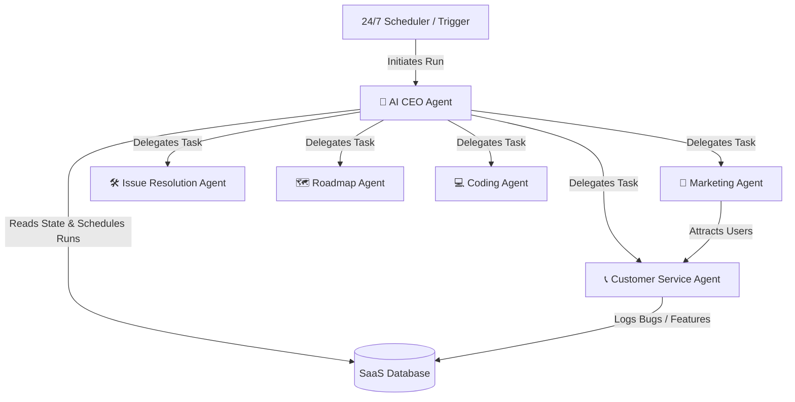

# 🤖 AI Agent Guidelines Summary - Solo Accounting

This directory outlines the AI agent framework that drives and automates the operations of the **Solo Accounting** business. Instead of just in-app features, these agents act as virtual team members to keep development fast, support responsive, and customer acquisition highly cost-effective.

---

## 📂 Business Operations Agents Dashboard

We have defined a centralized **AI CEO Agent** orchestrator that governs five distinct, highly specialized worker agents to manage different domains of the Solo Accounting business:

| Agent Name | Core Mandate | Primary Channels / Tools | Specification |
| :--- | :--- | :--- | :--- |
| **👑 AI CEO** | 24/7 governance, task planning, and orchestrating worker agents. | System DB, Webhooks, Scheduler | [ai_agents.md](file:///f:/AIML%20projects/solo-accounting/5_architecture/ai_agents.md) |
| **📞 Customer Service** | Strict anti-hallucination support answering and ticket routing. | Support Email, Ticketing Database | [customer_service_agent.md](file:///f:/AIML%20projects/solo-accounting/6_ai_agents/customer_service_agent.md) |
| **🛠️ Issue Resolution** | Nightly batch runs to resolve low-risk bug tickets. | Git, Local Sandbox Test Env | [issue_resolution_agent.md](file:///f:/AIML%20projects/solo-accounting/6_ai_agents/issue_resolution_agent.md) |
| **🗺️ Roadmap** | Aggregates feedback to maintain minor queue & propose major specs. | Feedback Parser, Backlog Manager | [roadmap_agent.md](file:///f:/AIML%20projects/solo-accounting/6_ai_agents/roadmap_agent.md) |
| **💻 Coding** | Nightly automated feature implementation & sandbox testing. | Compiler, Linter, Git PR | [coding_agent.md](file:///f:/AIML%20projects/solo-accounting/6_ai_agents/coding_agent.md) |
| **📣 Marketing** | Benign, organic, value-first small business community building. | Reddit, Social Media API | [marketing_agent.md](file:///f:/AIML%20projects/solo-accounting/6_ai_agents/marketing_agent.md) |

---

## 🔄 Multi-Agent Operations & Synergies

To run the Solo Accounting business at near-zero operational overhead, the AI CEO orchestrates the five worker agents in a continuous, cooperative loop:

1. **Information Flow:** User feedback collected by **Customer Service** is logged to the database, where the **AI CEO Agent** retrieves it and delegates roadmap planning to the **Roadmap Agent**, which then defines precise feature specs for the **Coding Agent**.
2. **Schedule Separation:** Under CEO governance, execution times are staggered to prevent database and repository locks (Bug fixes run at **02:00 AM**, Feature additions run at **03:00 AM**).
3. **Safety & Quality Gateways:** All engineering activities (Bug Fixes and Coding) require 100% test coverage and linter verification in the sandbox before the CEO approves pushing code to production.