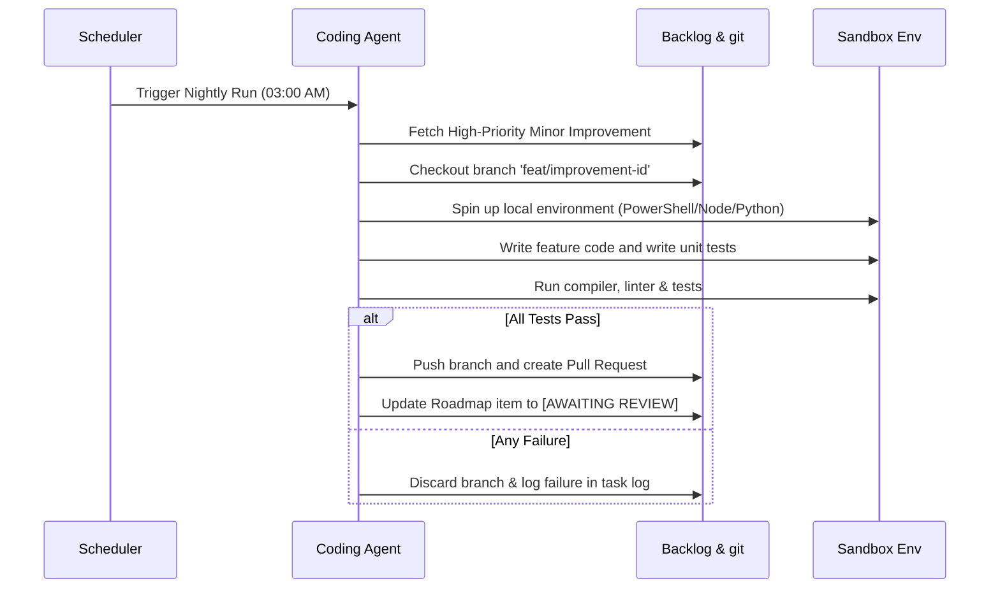

# 💻 Coding Agent Specification

The **Coding Agent** is a focused engineering agent that picks up high-priority, well-specified items from the **Minor Improvements** queue in the product backlog, writes the code, validates the implementation, and creates clean merge requests.

---

## 🎯 Objectives & Core Value
* **Nightly Progress:** Resolves exactly one minor feature or improvement every night.
* **Hermetic Sandbox Execution:** Operates in isolated containerized/sandboxed environments, ensuring that automated feature implementation never introduces security or runtime risks to the production system.
* **Rigorous Verification:** Compiles the application, runs the complete test suite, checks for linting errors, and verifies performance metrics before submitting a Pull Request.

---

## 🕒 Nightly Execution Sequence

---

## 🔒 Verification & Quality Guardrails

> [!IMPORTANT]
> **Strict Quality Standards:** To prevent poor code quality, the Coding Agent must adhere to these development rules:
> 1. **Test-Driven:** For every minor feature created, the agent **MUST** write corresponding unit or integration tests that prove its correctness.
> 2. **Linter Compliance:** The code must compile and pass all linter checks (e.g., ESLint, PyLint, or Ruff) with **zero** warnings.
> 3. **No Unused Code:** The agent must not leave temporary debug logs, print statements, or dead functions in the final commit.

---

## 🤝 Collaboration Boundaries with Issue Resolution Agent

Both the Coding Agent and the Issue Resolution Agent modify the codebase, which could lead to merge conflicts or redundant compute runs.
* **Separation of Hours:** The Issue Resolution Agent runs at **02:00 AM**, while the Coding Agent runs at **03:00 AM**. This prevents concurrent git branch locks.
* **Independent Branching:** The Coding Agent always prefixes its branches with `feat/` (e.g., `feat/FEAT-102`), whereas the Issue Resolution Agent prefixes with `bugfix/` (e.g., `bugfix/TKT-404`).
* **Conflict Resolution:** If a merge conflict is detected during the Coding Agent's run, the agent will abort the automated merge, push the branch with conflicts unresolved to a draft PR, and request a human to perform a manual merge.
