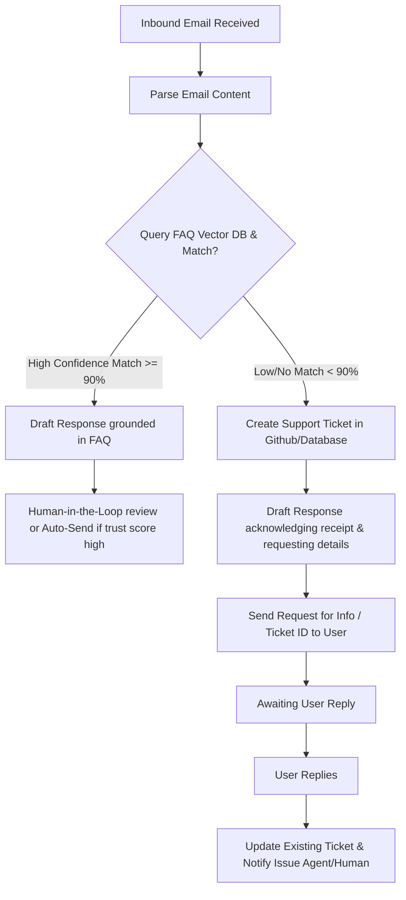

# 📞 Customer Service Agent Specification

The **Customer Service Agent** is responsible for managing all inbound support communications (e.g., support emails, contact forms) for the Solo Accounting business. The goal is to provide rapid, high-quality, privacy-respecting answers to customers while maintaining a zero-hallucination policy.

---

## 🎯 Objectives & Core Value
* **24-Hour Resolution/Response:** Ensure every user inquiry receives a professional reply within 24 hours.
* **Strict Anti-Hallucination Guardrails:** Under no circumstances should the agent invent features, pricing details, or troubleshooting steps. All responses must be grounded strictly in the official FAQ or Knowledge Base.
* **Smart Escalation & Ticketing:** When an inquiry cannot be answered with 100% confidence from the FAQ, the agent creates a structured support ticket and politely asks the user for more details.

---

## ⚙️ Operational Architecture



---

## 🛡️ Anti-Hallucination & Security Guardrails

> [!IMPORTANT]
> **Safety First:** Solo Accounting prioritizes user trust. If the FAQ is missing a direct answer, the agent MUST NOT guess.

### Grounding and Verification
1. **Source Grounding:** Every factual claim in the response email must contain a reference or citation link to the official documentation or FAQ.
2. **Deterministic Fallback:** If the system cannot resolve the exact question using semantic search with a high cosine similarity threshold (e.g., `0.85` or higher), the query must immediately trigger the ticketing workflow.
3. **No Private Data Leaks:** The agent must never share server logs, database schemas, or other users' billing information. Inquiries requesting private details must be handed off to a human supervisor immediately.

---

## 📂 Data Model & Integrations

### Support Ticket Schema
When creating a ticket, the agent generates the following structured JSON:
```json
{
  "ticket_id": "TKT-20260529-XXXX",
  "status": "OPEN",
  "priority": "LOW | MEDIUM | HIGH",
  "user_email": "user@example.com",
  "subject": "Unable to reconcile cash account",
  "original_inquiry": "My cash account shows a discrepancy of $20.00 after reconciliation. What should I do?",
  "faq_checked": false,
  "updates": [
    {
      "timestamp": "2026-05-29T17:50:00Z",
      "author": "Customer Service Agent",
      "action": "Ticket created. Emailed user to ask for a screenshot of the ledger screen."
    }
  ]
}
```

---

## 🤝 Human-in-the-Loop (HITL) Triggers
The agent automatically pauses and alerts a human operator under these conditions:
- User is expressing extreme frustration or anger (detected via sentiment analysis).
- The query involves critical security vulnerabilities or privacy breaches.
- The user replies with screenshots or files that need visual review or manual validation.
