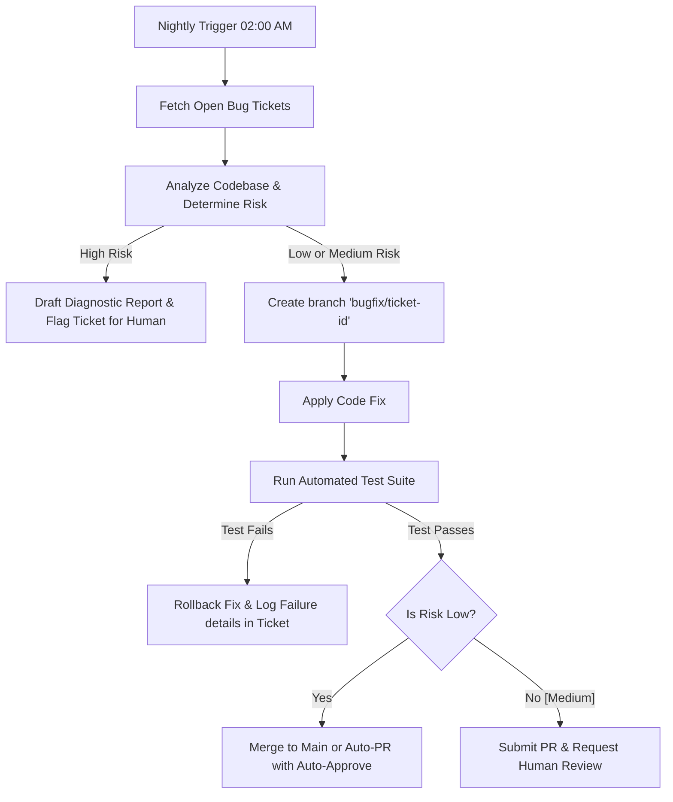

# 🛠️ Issue Resolution Agent Specification

The **Issue Resolution Agent** is a background automation service designed to pick up open bug tickets, analyze the problem, write patches, run local automated tests, and handle low-risk deployments. It runs on a scheduled batch sequence to minimize server costs and maximize reliability.

---

## 🎯 Objectives & Core Value
* **Cost-Efficient Batch Processing:** Executes during off-peak cloud compute hours or low-cost spot instance cycles.
* **Rigorous Risk Evaluation:** Classifies bugs into Low, Medium, or High risk levels to prevent automated regression or system instability.
* **Self-Healing Code Quality:** Checks out code, applies bug fixes, executes test suites, and only prepares Pull Requests/Merges if 100% of the tests pass.

---

## 🕒 Scheduling & Operational Costs

To maintain the low-cost model of Solo Accounting, this agent executes in batches:
* **Nightly Schedule:** Triggered every day at **02:00 AM local time** when cloud spot instance pricing is historically lowest.
* **Batch Sizing:** Processes a maximum of 10 bug tickets per run to avoid long-running compute loops.

---

## ⚖️ Risk Assessment Heuristics

Before modifying any source code, the agent performs a structural audit to determine the safety tier:

| Risk Category | Criteria / Impact Area | Action Path |
| :--- | :--- | :--- |
| **LOW** | Layout fixes, typo corrections, styling updates, documentation amendments, or simple isolated pure function fixes with 100% test coverage. | **Automated Fix:** Apply change, run tests, and automatically submit Pull Request. |
| **MEDIUM** | State management, input validation, external utility library updates, or code touching database helpers. | **Semi-Automated Fix:** Apply fix in a feature branch, verify tests pass, and notify a human maintainer to manually review the Pull Request. |
| **HIGH** | Core double-entry ledger calculation engines, cryptographic functions, backup/restore logic, or major framework upgrades. | **Strict HITL:** Do NOT attempt automated changes. Produce a diagnostic report with recommended steps and hand it off to a human developer. |

---

## ⚙️ Branching & Verification Flow

---

## 🔒 Verification & Safety Policies

> [!WARNING]
> **Safety Lock:** If any unit test or integration test fails during the automated test suite execution, the agent must immediately discard all changes, close the scratch branch, and update the ticket status to `FAILED_VERIFICATION` with the test logs attached. It must never commit broken code to the repository.
