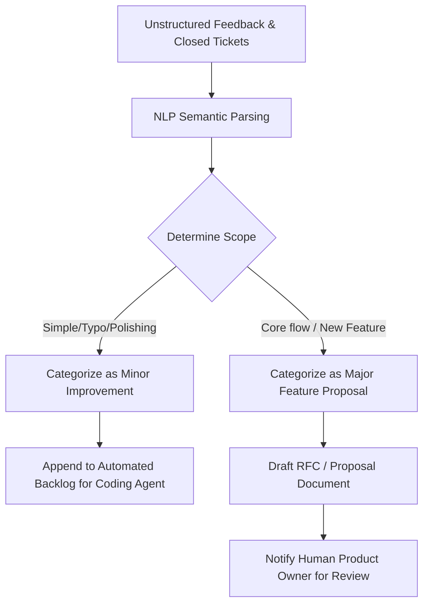

# 🗺️ Roadmap Agent Specification

The **Roadmap Agent** is responsible for product management assistance. It continuously parses customer complaints, support emails, app store ratings (if applicable), and human developer suggestions to construct, balance, and maintain the product feature backlog.

---

## 🎯 Objectives & Core Value
* **Feedback Synthesis:** Convert unstructured customer support tickets and user suggestions into actionable engineering requirements.
* **Roadmap Structuring:** Maintain a prioritized list of **Minor Improvements** that can be resolved automatically by the Coding Agent.
* **Strategic Proposals:** Identify and draft comprehensive spec proposals for **Major Improvements** that are kept in a pending queue for human product owner review.

---

## 🧠 Synthesis & Backlog Sorting

The agent runs a sentiment and thematic categorization pipeline:



---

## 📑 Roadmap Backlog Format

The agent manages a structured `ROADMAP.md` backlog with the following syntax:

```markdown
# Product Backlog & Roadmap

## 🚀 Minor Improvements (Automated Queue)
*These tasks are ready to be picked up by the Coding Agent.*
- [ ] **FEAT-102:** Add currency format support for EUR (€) in Invoice Template.
- [ ] **BUG-204:** Fix rounding bug in sales tax calculation (2 decimal places).

## 💡 Proposed Major Features (Awaiting Human Approval)
*Drafted specifications awaiting developer validation.*
- [ ] **PROP-01:** PLAIDSNC - Direct Plaid bank sync integration. [Review spec proposal](file:///f:/AIML%20projects/solo-accounting/4_product_spec/bank_sync.md)
- [ ] **PROP-02:** OCR-Receipts - Local Tesseract-based receipt scanning engine.
```

---

## 🤝 Human-in-the-Loop Approval Criteria

> [!IMPORTANT]
> **Product Governance:** The Roadmap Agent can append items to the **Minor Improvements** queue, but it must **never** promote a **Proposed Major Feature** to active development without explicit human sign-off (either via a chat slash command, GitHub reaction, or configuration update).
