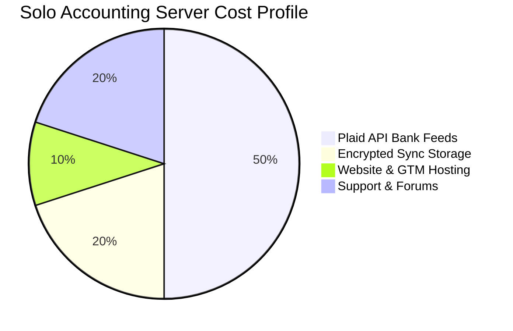

# 💸 Business & Revenue Model Summary - Solo Accounting

This document details the sustainable commercial strategy for Solo Accounting. We reject the standard industry trend of forcing users into expensive, bloated monthly subscriptions. Instead, we propose a transparent, value-first monetization strategy.

---

## 💎 The Monetization Philosophy

1. **We Do Not Harvest Data:** Standard "free" financial software treats the user's ledger as a product, scraping transaction history to sell third-party loans. Solo Accounting guarantees absolute privacy.
2. **Local Core is Free Forever:** The fundamental right to manage your own business ledger should be free. The desktop core application will never require a paid subscription.
3. **Cloud Convenience as a Paid Utility:** Monetization is driven entirely by high-value, optional cloud extensions (multi-device sync, bank feeds, payment processing) priced at near-utility costs.

---

## 🏷️ Proposed Pricing Tiers

```text
┌────────────────────────┐      ┌────────────────────────┐      ┌────────────────────────┐
│      LOCAL CORE        │      │       SOLO SYNC        │      │    UTILITY PLUS        │
│      Free Forever      │      │       $3 / month       │      │       $5 / month       │
├────────────────────────┤      ├────────────────────────┤      ├────────────────────────┤
│  • Desktop app         │      │  • Everything in Free  │      │  • Everything in Sync  │
│  • SQLite Storage      │      │  • E2EE Cloud Sync     │      │  • Live Bank Feeds     │
│  • Unlimited Invoices  │      │  • Automatic Backups   │      │  • Stripe 1-Click Pay  │
│  • Manual CSV Imports  │      │  • Mobile Companion    │      │  • Tax filing export   │
└────────────────────────┘      └────────────────────────┘      └────────────────────────┘
```

### 1. Local Core (Free Forever)
* **Target:** Freelancers and micro-operators starting out.
* **Features:** Full double-entry bookkeeping, invoice creation, vector PDF export, drag-and-drop CSV importer, local SQLite storage.
* **Price:** $0.

### 2. Solo Sync ($3 / month or $30 / year)
* **Target:** Multi-device solopreneurs (e.g., managing books on Laptop and capturing receipts on Mobile).
* **Features:** End-to-end encrypted real-time sync, automated secure cloud backups, mobile companion app (read-only views + receipt snapping).
* **Price:** $3/mo.

### 3. Utility Plus ($5 / month or $50 / year)
* **Target:** Active operators wanting complete automation.
* **Features:** E2EE Sync, automated live bank feeds (via Plaid/Yodlee integration), one-click customer credit card/ACH billing via Stripe, and automated local tax reporting exports.
* **Price:** $5/mo.

---

## 📉 Estimated Operational Cost Structure

Because Solo Accounting is a **local-first** application, our operational costs are a fraction of traditional SaaS vendors:



* **Zero Server-Side Computation:** The user's own computer does 99% of the rendering and mathematical calculation. We do not run massive, expensive server clusters to compute ledgers.
* **Ultra-Compact Sync Blobs:** Since databases are SQLite, syncing only involves transmitting tiny, compressed encrypted binary diffs. Our bandwidth and storage costs are negligible.
* **Margin Health:** Even at $3-$5/month, the high efficiency of local-first operations guarantees strong profit margins while remaining 80% cheaper than QuickBooks.
