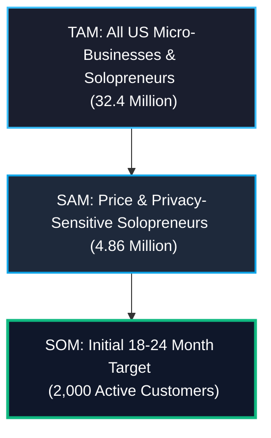

# 📈 Market Size & Breakeven Analysis

This document examines the Total Addressable Market (TAM), Serviceable Addressable Market (SAM), and Serviceable Obtainable Market (SOM) for **Solo Accounting**, followed by a rigorous breakeven analysis based on our variable contribution margins.

---

## 🎯 Target Market Segments

Solo Accounting is laser-focused on businesses with **fewer than 10 employees**, with a strong focus on **single-operator solopreneurs** (non-employer firms). This is a massive, underserved, and highly cost-sensitive segment of the economy.

### 1. Total Addressable Market (TAM)
* **Definition:** All micro-businesses and independent contractors in the United States.
* **SBA Statistics:** According to the US Small Business Administration (SBA):
  * There are **~33.2 million** small businesses in the US.
  * **~27.1 million** are **non-employer firms** (solopreneurs, freelancers, independent contractors).
  * **~5.3 million** are micro-businesses with **1 to 9 employees**.
* **Total TAM:** **32.4 million businesses** (comprising 97.5% of all US enterprises).

### 2. Serviceable Addressable Market (SAM)
* **Definition:** Solopreneurs and micro-businesses that are price-sensitive, value data privacy, and require basic income/expense tracking, client invoicing, and basic tax readiness, but do not need complex enterprise features.
* **Estimation:** We estimate that **15%** of the TAM actively seeks an alternative to expensive, corporate SaaS suites like QuickBooks (which starts at $30+/mo).
* **Total SAM:** **~4.86 million businesses**.

### 3. Serviceable Obtainable Market (SOM)
* **Definition:** Tech-forward, privacy-centric freelancers, gig workers, and artisan businesses that prefer a zero-setup, lightweight cloud-native application.
* **Target:** Our conservative initial target is to capture a tiny fraction (**0.04%**) of the SAM within our first 18-24 months of operation.
* **Total SOM:** **2,000 active customers**.

---

## ⚖️ Breakeven Analysis

To understand the feasibility of this project, we must determine the exact number of customers required to cover our fixed operating overhead.

### 1. Fixed Annual Operating Overhead
Because we prioritize a highly automated, low-overhead cloud SaaS model, our fixed costs are exceptionally lean:

| Fixed Expense Category | Annual Cost | Monthly Equivalent |
| :--- | :---: | :---: |
| California LLC Tax (Minimum Franchise Tax) | $800.00 | $66.67 |
| Domains, Professional Email, and SSL Certificates | $200.00 | $16.67 |
| Security Review & Admin Tools | $500.00 | $41.67 |
| Legal, CPA, and Compliance Software | $1,000.00 | $83.33 |
| Value-First Organic Community Marketing | $500.00 | $41.67 |
| **Total Fixed Costs** | **$3,000.00** | **$250.00** |

### 2. Breakeven Formula
Our blended contribution margin is **$4.09 per user per month** (reflecting 70% annual and 30% monthly subscribers, after paying Stripe fees and variable COGS).

$$\text{Breakeven Customers} = \frac{\text{Fixed Monthly Expenses}}{\text{Blended Contribution Margin per User}}$$

$$\text{Breakeven Customers} = \frac{\$250.00}{\$4.09} \approx 61.12$$

> [!IMPORTANT]
> **Breakeven Threshold:** Solo Accounting requires only **62 active, paying customers** to achieve full operational breakeven!

### 3. Margin of Safety at SOM Target
If we achieve our conservative SOM target of **2,000 active customers**:
* **Total Blended Net Revenue (After Stripe & COGS):** $8,180.00 / month ($98,160.00 / year)
* **Less Fixed Costs:** -$250.00 / month (-$3,000.00 / year)
* **Net Operating Surplus:** **$7,930.00 / month ($95,160.00 / year)**
* **Margin of Safety:** **96.9%** (We can lose 96.9% of our target customers and still remain self-sustaining).
